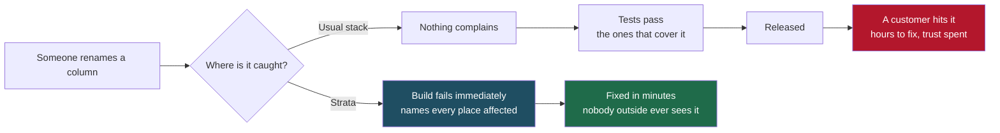
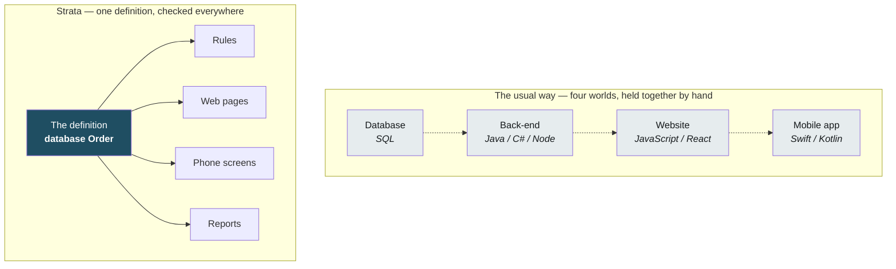

# Strata

**The compiler is the code reviewer.**

*An independent project by Prabath Kumar. Not a product of, and not owned by,
any employer or client.*

Strata is a systems language for a world where most code is written by machines.
Describe what you want, let a model write it, and let the compiler — not a tired
human on a Friday afternoon — prove the pieces actually fit. When it doesn't fit,
Strata hands the model a structured diagnostic and the model fixes it. Often
before you look.

```
$ strata build ledger.sta
  [E004] Column 'sec_tier' does not exist in 'UserProfile' (line 5, col 5)
  Hint: Valid columns: ['user_id', 'security_tier']

$ strata repair ledger.sta
  pass 1: E004 Database Schema Selector Violation (line 5)
    patch applied, recompiling
  clean after 1 repair(s).
```

That loop is real and runs today. Most of what surrounds it does not yet — see
[Roadmap](#roadmap), which is exhaustive and blunt.

> **Status: pre-release, under active development.** Nothing in this document
> is claimed to work unless it is in [What works today](#what-works-today) or
> marked **Done** in the [Roadmap](#roadmap), which is exhaustive and blunt
> about what is not. Every code example below is compiled on every commit by
> `test_suite/doc_examples.py`, so an example that stopped working would fail
> the build rather than sit here.

## For business readers

Three sentences, then a picture.

**One definition.** A business system has a handful of facts at its centre —
what an order is, what a customer is, what a payment is. In Strata those facts
are written down once, in the language itself.

**One check.** Everything else in the system — the rules, the reports, the web
pages, the phone screens — is checked against that definition when the software
is built, not when a customer uses it.

**Every surface.** The same definition serves the website, the mobile app and
the database. They cannot drift apart, because there is only one of them.

### Where a mistake gets caught

The cost of a mistake is mostly decided by *when* it is found. A typo found
while typing costs seconds. The same typo found by a customer costs an apology,
an investigation, a fix, a release, and some trust.



### Why that is hard to do normally

A typical business system is built from four separate worlds that do not know
about each other. Keeping them agreeing is manual work, and it is the work that
quietly stops being done when a deadline arrives.



The dotted lines are the problem: nothing enforces them. The solid lines are
enforced by the compiler, every time the software is built.

### What this buys, in plain terms

| | |
|---|---|
| Fewer production surprises | A whole class of bug — "the app and the website disagree" — stops being possible, because there is one definition rather than several |
| Cheaper change | Changing a business fact is one edit; the compiler then lists every place that must follow, instead of somebody searching for them |
| Smaller teams | One language across the server, the web and the phone means one skill set, not four |
| Safer AI-written code | A machine writes fast and is confidently wrong. The compiler catches what code review misses, and hands the machine a precise description to fix |

### What it is not

It is pre-release, weeks old, and written by one person. It has no ecosystem
and nobody else knows it yet. It is not something to put a production system on
today. What it is: a demonstration that the idea works, tested harder than most
shipped software — see the evidence below, and the
[Roadmap](#roadmap), which lists what is still missing without softening it.

---

## Licence and ownership

Strata is an independent project by Prabath Kumar, licensed **Apache-2.0** —
chosen over MIT because it carries an express patent grant from contributors,
which is what a language intended for enterprise use needs.

**Programs compiled with Strata are not covered by that licence.** The
compiler pastes 800 lines of runtime support into every program it builds, so
without an exception every binary anyone produced would contain Apache-2.0
code and inherit its attribution obligations — for code they did not write.
`LICENSE-EXCEPTION` grants the additional permission that removes this, in the
same way and for the same reason as the Swift and LLVM runtime library
exceptions. What you build with Strata is yours.

## What exists

| | |
|---|---|
| Language | 11,700 lines of Strata in this repository — the compiler, the standard library, three applications and the examples |
| Compiler | Self-hosting front end: lexer, parser, type checker and code generator written in Strata, 7,500 lines, **2.2% `native`**. Each is checked against an independent Python implementation on every commit — tokens, syntax trees, diagnostics and generated C compared byte for byte |
| Fixpoint | The front end rebuilt from C it generated itself reproduces that C exactly |
| Standard library | 15 modules that compile, link and run |
| Applications | An orders web service, a financial ledger, and a phone app — all on one schema definition each |
| Storage | Tab-separated files or PostgreSQL, chosen by changing a string; writes send only the rows that changed |
| Surfaces | One `layout` renders as a web page and draws as a phone screen |
| Tests | 23 suites — 185 conformance cases and 9 end-to-end journeys that install the toolchain, build a service, change it, deploy it in Docker, flood it, operate it, talk to a real PostgreSQL, and run the same rules on a phone's processor |
| CI | 34 steps on every push, including a real PostgreSQL 16 and an ARM64 cross-compiler and emulator |

The journeys are the unusual part. Each walks a whole path a person would
take, end to end, and fails if any step of it does: 26 checks for using the
orders service, 44 for operating it, 32 for installing the toolchain on a
machine that has never seen it, 40 against a live database, 28 for the phone.
They are where most of the bugs in this repository were found, and the
changelog says which.

---

## 1. Why another language

Most code will soon be written by machines and reviewed by people. That inverts
what a compiler is for.

When a human writes code, the compiler is a safety net for mistakes the author
already half-knows they might make. When a model writes code, the failure mode
is different: the output is *fluent and plausible and wrong*. It compiles, it
reads well, and the schema it queries has a column that does not exist. A
reviewer skims it, sees idiomatic code, and approves.

The languages we have were designed for the first case. Strata is designed for
the second. The premise is that **the compiler, not the reviewer, should be the
thing that catches it** — and that the compiler's output should be structured
well enough for a machine to act on without a human in the middle.

That leads to two design commitments:

**Contracts across tier boundaries are checked at build time.** A database
column, a network packet layout, a tensor shape — these are places where one
part of a system makes an assumption about another. In most stacks those
assumptions are strings, ORMs, or conventions, and they fail at runtime. In
Strata they are declarations the compiler checks.

**Diagnostics are data, not prose.** Every error carries a taxonomy code, a
location, a hint, and a remediation strategy, emitted as JSON. A repair agent
reads the diagnostic and patches the source without parsing human-readable
compiler text.

Strata is intended to be written by AI, read by AI, and reviewed by developers —
with the compiler as the arbiter that makes that division of labour safe.

---

## 2. What works today

### Compile-time database contracts

A `database` block is a schema the compiler knows about. Queries against it are
checked when you build, not when you deploy.

```text
import io from std;

database TransactionLedger {
    int   transaction_id;
    str   client_uuid;
    float capital_delta;
    str   compliance_status;
}

list[TransactionLedger] rejected_transactions() {
    list[TransactionLedger] violations = TransactionLedger <- [compliance_status == "REJECTED"];
    return violations;
}

int main() { print("audit ready"); return 0; }
```

Misspell `compliance_status` and the build stops with `E004`, naming the valid
columns. The same check applies to the write form of the operator:

```text
import io from std;
database AuditTrail { int event_id; str actor; str action; }
def record(int id, str who, str what) {
    AuditTrail <- [event_id = id, actor = who, action = what];
}
int main() { record(1, "prabath", "deploy"); return 0; }
```

An insert must name every column: leave one out and the build stops with
`E009`, because the alternative is writing it as a zero in every row the
statement creates, with nothing to show it was forgotten.

### Zero-copy structural casts

A `protocol` describes a byte layout. The `::` operator reinterprets a buffer as
that layout with no copy and no parse, and the compiler rejects a cast to a type
that was never declared.

```text
import io from std;
protocol NetworkPacketHeader { int packet_id; str target_routing_node; int data_payload_bytes; }
def handle(str socket) {
    NetworkPacketHeader header = current_raw_buffer() :: NetworkPacketHeader;
    if (header.data_payload_bytes > 32768) { print("oversized packet dropped"); }
}
```

### Explicit types and structure

Strata has no type inference and no dynamic coercion. Every declaration carries
its type, every block is brace-delimited, every statement is semicolon-
terminated.

```text
import io from std;
int risk_band(int score) { if (score > 850) { return 2; } return 1; }
int main() { int total = 400 + 500; print(str(risk_band(total))); return 0; }
```

This is a deliberate choice for machine authorship. Significant whitespace makes
a generated edit's meaning depend on invisible characters; explicit delimiters
make a patch unambiguous to apply and unambiguous to verify. Readability here
comes from explicit structure, not from resembling English — English is
ambiguous, and ambiguity is the thing being engineered out.

### WebAssembly

`--target wasm` builds a freestanding module — no libc, no runtime to ship —
exporting every top-level function:

```
$ strata build scoring.sta --target wasm -o scoring.wasm
```

Running it from a host:

```
exports: ['memory', 'classify', 'label', 'checksum', 'score_of']
classify(900) -> PRIME      label -> tier: PRIME
classify(100) -> SUBPRIME   label -> tier: SUBPRIME
```

Measured sizes, from the modules above rather than from an estimate: a module
of four string-handling functions is **595 bytes** (436 gzipped); two integer
functions are **136 bytes**. Strings and allocation work — `label` concatenates
through a bump allocator built into the prelude.

The trade-offs are real and worth stating. There is no `free`, so a
long-running module exhausts its heap; there is no file I/O; floats format to
six decimals rather than shortest-round-trip, because that needs `snprintf`.
This suits computation, not a server. And WebAssembly cannot touch the DOM, so
a UI still needs a JavaScript shim — the `layout` tier is server-rendered
instead.

### Model inference

A `model` declares a tensor contract the compiler enforces, and `predict` runs
it:

```text
import io from std;

model RiskScorer {
    input:  tensor[float, 1, 3];
    output: tensor[float, 1, 2];
}

int main() {
    tensor[float, 1, 3] features = strata_tensor(3);
    strata_tensor_set(features, 0, 2.0);
    strata_tensor_set(features, 1, 3.0);
    strata_tensor_set(features, 2, 4.0);

    strata_model_load(RiskScorer, "examples/risk_weights.txt");

    tensor[float, 1, 2] scores = predict RiskScorer(features);
    print(str(strata_tensor_get(scores, 0)));
    return 0;
}
```

Pass a tensor of the wrong shape and the build stops:

```
[E006] Tensor shape mismatch for 'RiskScorer': expected [1,3], got [1,32]
```

**The runtime is one dense layer** — `output = input x W + b`, weights read
from a whitespace-separated text file. No hidden layers, no activations beyond
the identity, no training, no GPU, no interop with existing frameworks. An
untrained model predicts zeros rather than garbage. This is enough for a linear
model to run and for the shape contract to mean something; it is not a machine
learning framework and is not meant to be read as one.

### Tests in the language

A `verify` block is a test. `strata test` builds and runs them:

```
$ strata test test_suite/verify_cases
  doubling
  halving
    FAIL  line 12: half(...) == 4

  2 block(s), 5 assertion(s), 1 failed
```

A failing assertion reports its line and a rendering of the expression, and
does not stop the rest of the block — one broken assertion should not hide the
others. The process exits non-zero if anything failed.

No fixtures, no setup and teardown, no parallelism, no filtering.

### Persistence

Tables are written as tab-separated text, with serialisers generated from the
schema:

```text
import io from std;
database Account { int id; str holder; float balance; }

int main() {
    load Account from "accounts.tsv";
    list[Account] existing = Account <- [id > 0];
    print(str(len(existing)));

    Account <- [id = 1, holder = "alpha", balance = 1250.75];
    save Account to "accounts.tsv";
    return 0;
}
```

Text rather than a binary format, so a table is inspectable with the tools
everyone already has. Tabs, newlines and backslashes in string fields are
escaped. The file carries a header naming each column and its type, so a table
saved under one version of a schema loads under another.

The same three words answer, so a program can tell whether the store did what
it was asked:

```text
import io from std;
import str from std;
database Booking { int id; str guest; int expires_at; }

int main() {
    Booking <- [id = 1, guest = "alpha", expires_at = 10];
    Booking <- [id = 2, guest = "beta",  expires_at = 99];

    if (save Booking to "bookings.tsv") { print("stored"); }
    else { print("NOT stored"); }

    int pruned = delete Booking <- [expires_at < 50];
    print(str_concat("pruned: ", str(pruned)));
    return 0;
}
```

`save` and `load` give 1 when the store now matches memory and 0 when it does
not; `delete` gives the number of rows that went. They were statements with no
value, which meant a handler could not tell a successful write from a failed
one — a service pointed at a database that was not there logged the connection
error, told the customer the order was created, and exited 0.

A load can fetch part of a table, and the same table can live in PostgreSQL
instead of a file — see [Where the data lives](#where-the-data-lives).

What this is not: there is no index, and a query is a scan. A table is held
entirely in memory once loaded, so the working set has to fit.

### Calling existing C libraries

A `foreign` block declares what a library provides. The signatures are
registered like any other function, so the boundary is checked rather than
trusted.

```text
import io from std;

foreign "math.h" link "m" {
    float sqrt(float x);
    float pow(float base, float exponent);
}

int main() {
    print(str(sqrt(144.0)));
    print(str(pow(2.0, 10.0)));
    return 0;
}
```

Pass a `str` where the library expects a `float` and the build stops with
`E005` — Boundary Perimeter Contamination — rather than producing undefined
behaviour at runtime.

### Machine-readable diagnostics

```
$ strata build ledger.sta --json
```
```json
{
  "file": "ledger.sta",
  "stage": "typecheck",
  "ok": false,
  "error_count": 1,
  "diagnostics": [
    {
      "code": "E004",
      "classification": "Database Schema Selector Violation",
      "severity": "CRITICAL_HALT",
      "message": "Column 'sec_tier' does not exist in 'UserProfile'",
      "line": 5,
      "column": 5,
      "hint": "Valid columns: ['user_id', 'security_tier']",
      "remediation_strategy": "Audit database table block schemas, match column property name spellings inside query bracket filters."
    }
  ]
}
```

### The repair loop

`ai_self_repair.py` compiles, reads the diagnostics, patches, and recompiles
until the file is clean or no further progress is possible:

```
[Strata Repair] target: ledger.sta   backend: rules

  pass 1: 2 diagnostic(s) at stage 'typecheck'
    E001 Variable Mutation Mismatch (line 4): Type mismatch: 'request_count' declared as 'int' but assigned 'str'
    patch applied, recompiling

  pass 2: 1 diagnostic(s) at stage 'typecheck'
    E004 Database Schema Selector Violation (line 5): Column 'sec_tier' does not exist in 'UserProfile'
    patch applied, recompiling

[Strata Repair] clean after 2 repair(s).
```

`test_suite/self_repair.py` runs on every commit. It checks the loop — that it
converges, that it stops rather than spinning when a repair needs judgement,
that `--dry-run` restores the file byte for byte — and, more importantly, the
JSON contract the loop depends on. Every key the loop reads is asserted
present and correctly typed, because renaming one would not break the loop
loudly; it would make it repair nothing and report that nothing was possible.


Repair backends are pluggable. `rules` is deterministic and offline. `llm` sends
the diagnostic and source to a language model and needs no prior knowledge of
Strata, because the classification and remediation strategy travel with the
error.

### Error taxonomy

| Code | Classification | Raised when |
|------|----------------|-------------|
| `E001` | Variable Mutation Mismatch | assigned value conflicts with the declared type |
| `E002` | Function Return Contract Breach | a return path breaks the signature |
| `E003` | Generic Collection Pollution | mixed types enter a homogeneous list |
| `E004` | Database Schema Selector Violation | a query or insert names a column that does not exist |
| `E005` | Boundary Perimeter Contamination | untyped data crosses a type boundary |
| `E006` | Tensor Dimension Drift | a tensor does not match its declared shape |
| `E007` | Unresolved Module Import | an import names a module with no local checkout |

`E001`–`E006` are `CRITICAL_HALT`: they stop the build. `E007` is `ADVISORY` —
it is reported and the build continues, because a dependency provided at link
time is legitimate. The JSON payload separates them: `error_count` and `ok`
count only halting diagnostics, `advisory_count` the rest, so a repair loop
does not burn passes on something it cannot fix.

Defined in `ERROR_TAXONOMY.json`, which is the contract repair agents consume.

---

### Memory that is given back

Strata frees nothing one value at a time. Temporaries — concatenations,
numbers turned into text, string builders, query results — come from an arena,
and `scratch_reset()` throws the whole arena away at a point the program
chooses. Tables keep their own copies of what they hold and survive the reset.

```text
import io  from std;
import str from std;

database Note { int id; str body; }

int main() {
    Note <- [id = 1, body = "this survives every reset"];

    int r = 0;
    while (r < 2000) {
        int j = 0;
        while (j < 2000) {
            str line = str_concat("customer ", str(j));
            j = j + 1;
        }
        scratch_reset();        // the frame, request or batch is over
        r = r + 1;
    }
    return 0;
}
```

Measured, because the claim is the point:

| | peak memory | held at exit |
|---|---|---|
| 4,000,000 temporaries, resetting | 1.4 MB | 0 bytes |
| 1,000,000 temporaries, no reset | 93 MB | 96 MB |

Four times the work in a sixty-seventh of the memory. This is what lets a
server run for a week rather than growing until something kills it.

**The rule, and it is the whole danger:** after `scratch_reset()` every
temporary is gone. Whatever must outlive it belongs in a table. The reset is
placed by hand and calling it while a temporary is still in use is a
use-after-free that nothing catches. A batch job that runs and exits never
needs it at all.

Rows removed by `delete` are reclaimed at the same moment, for the same
reason: a query result pointing at a deleted row is itself arena memory, so
both go together.

This is not individual deallocation. There is still no way to free one value,
and one request that builds something enormous holds it until the next reset.

### Errors that cannot pass for success

There are no exceptions. A load that meets a damaged file refuses it, says why
on stderr, and leaves the table empty. A program that did not check used to
carry on with no rows and no idea.

```text
load Sale from "sales.tsv";

if (had_error() == 1) {
    print(last_error());
    clear_error();              // handled; the program exits normally
}
```

Handle it and nothing changes. Ignore it and the program prints which error
went unchecked and **exits 65**, where a shell script, a CI job and an
operator all notice. Halting at the point of failure would be wrong — a server
should not die because one stored row is bad — so the run is untouched and the
accounting is at the end.

The error is a single global flag: two failures before a check leave only the
second message, and a function still cannot report a failure to its caller.

## 3. Workflows

The short version of how the pieces above are actually used.

### Build and run something

```bash
strata new myapp && cd myapp
strata run                      # builds src/main.sta and runs it
strata check src/main.sta       # types and contracts, no binary
strata test                     # runs every verify block
strata fmt src/*.sta --check    # canonical formatting, as CI enforces it
```

### A batch job

Read, transform, write, exit. The arena is never reset, because the process
ends and the operating system takes the memory back.

```text
import io  from std;
import str from std;

database Ledger { int id; float amount; str compliance_status; }

int main() {
    load Ledger from "ledger.tsv";
    if (had_error() == 1) {
        print(last_error());
        return 1;
    }

    list[Ledger] flagged = Ledger <- [compliance_status == "REJECTED"];
    print(str_concat("to review: ", str(count(flagged))));

    save Ledger to "reviewed.tsv";
    return 0;
}
```

For a table too large to hold, `scan` reads it a row at a time, `append` adds
one without loading the rest, and `rewrite` changes rows in place through an
atomic rename — all at constant memory.

### A service handling requests

One reset per request is the whole memory story.

```text
import io  from std;
import mem from std;
import str from std;

database Order { int id; str customer; }

int handle(str message) {
    Order <- [id = count(Order <- [id > 0]) + 1, customer = message];
    return 1;
}

stream orders(str broker_url) {
    handle(current_message());
    scratch_reset();            // everything this request built is gone
}

int main() {
    print("one reset per request is the whole memory story");
    return 0;
}
```

### A phone screen

The shell asks Strata for a display list, paints it, and reports taps. Five C
functions are the entire boundary, and the reset goes at the top of a frame.

```text
import io  from std;
import mem from std;
import str from std;

database Row { int id; str text; }

int build_frame() {
    Row <- [id = 1, text = str_concat("drawn at ", str(1))];
    return count(Row <- [id > 0]);
}

int host_draw() {
    scratch_reset();            // last frame's strings
    delete Row <- [id > 0];
    return build_frame();
}

int main() {
    print(str(host_draw()));
    print(str(host_draw()));
    return 0;
}
```

`apps/orders_mobile/ios/` carries a committed Xcode project; the Android shell
in `apps/orders_mobile/android/` is the same contract through JNI. Neither has
run on a handset — see the roadmap.

### When something is wrong

```bash
strata check file.sta --json    # machine-readable diagnostics
strata deps                     # fetch the dependency graph
strata repair file.sta          # rules-based fixes; --backend claude for more
```

## 4. Toolchain

### Installing it

```
git clone https://github.com/prabathkumar/strata-core
cd strata-core
tools/install.sh
```

That copies a self-contained toolchain into `~/.strata` and puts a `strata`
command in `~/.local/bin`. `--prefix` and `--bindir` move both; `--uninstall`
removes them. The installer checks for a C compiler before it copies anything —
Strata compiles to C, so a machine without one cannot build — and finishes by
creating and building a throwaway project outside the source tree. If that
fails it says so and exits non-zero, rather than printing "installed" and
leaving the first developer to find out.

The install does not point back at the checkout. Delete the clone afterwards
and the toolchain keeps working; `test_suite/journey_install.py` deletes it on
purpose and builds again to prove it.

### Editing it

`editor/vscode-strata` is a VS Code extension: syntax highlighting for `.sta`,
the compiler's own diagnostics underlined where they happened as you type,
and **repair on the lightbulb** — the Quick Fix on a Strata error runs
`strata repair`, which reads the compiler's machine-readable diagnostics,
patches the source and recompiles until it is clean. Every other language's
Quick Fix is a rule somebody wrote into the editor by hand; this one is the
compiler. It saves the document first, because repair works on the file on
disk, and it is offered rather than automatic — a compiler that edits your
code without being asked is not a feature. It is not a language server. `strata check` is fast and is the same
check CI runs, so the extension runs the real compiler rather than
reimplementing the rules — a second implementation would be the first thing to
drift out of step with the first. If the editor and the build disagree, the
extension is wrong.

Inside a query, a bare name is a column rather than a variable, and the
grammar colours it differently. That is the difference between reading
`[token == token]` as a comparison and seeing it for the mistake it is.

```
cp -R editor/vscode-strata ~/.vscode/extensions/strata
```

### Where the data lives

A `database` block is stored in a tab-separated file by default. Importing one
module moves it into PostgreSQL, and nothing else in the program changes:

```
import postgres from std;
...
save Order to "data/orders.tsv";      // a file
save Order to "$DATABASE_URL";        // a table in PostgreSQL
```

The path decides. A path beginning with `$` names an environment variable, so
the URL and its password are supplied at deploy time rather than compiled into
the binary. The schema, the queries, the aggregates and the pages are
untouched, and the compiler still checks every column name against the
`database` block.

Importing the module is also what links libpq. A program that does not import
it has no libpq dependency at all — `journey_postgres.py` checks the binary's
linked libraries to make sure, because "it should not be linked" is a claim
and `ldd` is evidence.

A save writes only the rows that changed. Each table remembers, per row, its
key and a fingerprint of its values as they were at the last read or write; a
row that still matches is not sent, a key that has gone from memory is deleted,
and everything else is an upsert. Changing one order in a table of two hundred
is one `UPDATE`, and `journey_postgres.py` proves it with a trigger inside the
database counting every write the table actually receives.

The one sharp edge, stated rather than left to be found: a save that follows a
load writes the difference; a save with **no** prior load from that URL
replaces the table, because a process that has not read the table cannot know
what else is in it. The first column is the key when it is an integer — the
convention every `database` block here already follows. A table whose first
column is not an integer keeps the whole-table replace.

The connection is opened once per process and reused, and the process id is
part of its identity: a service that forks per request would otherwise have
parent and child talking down the same socket.

A load can fetch part of a table, written the way every other query in the
language is written:

```
load Order from "$DATABASE_URL" <- [status == "OPEN" && region == "apac"];
```

Against a database that becomes a `WHERE` clause and only the matching rows
cross the wire. Against a file the rows are read and then dropped, which is
the same answer by a slower road — and that is the point: the program means
the same thing either way.

Only the conditions that mean the same thing in both places are translated:
comparisons between a column and an integer or string literal, joined by `&&`
and `||`. Anything else — a function call, arithmetic, a float literal —
loads the table and filters in memory, exactly as before. A WHERE clause that
was subtly wrong would silently return the wrong rows, so the rule is to
translate what is certain and decline the rest. `save` takes no filter: a
partial save would mean the store no longer matches memory, which is the one
thing `save` promises.

The remaining limits: there is no connection pool beyond one handle per
process, and the cached-load optimisation does not apply to a database,
because a file has a modification time to compare and a query does not.

### Commands

```
strata build <file.sta>          compile to a native binary
strata build <file.sta> --json   compile, emitting diagnostics as JSON
strata build <file.sta> --test   build a runner for the file's verify blocks
strata check <file.sta>          type-check without generating code
strata test <dir>                build and run every verify block in <dir>
```

The bootstrap compiler is written in Python and generates C, which is then
compiled to a native binary. This is how most languages begin — Rust's first
compiler was written in OCaml, Go's in C, and C++ shipped for years as a
preprocessor that emitted C. Self-hosting is on the roadmap below. Users write
only `.sta` files; the implementation language is not part of the programming
model.

---

## 5. Adoption

**One file, one command.** A Strata program is a `.sta` file. `strata build`
turns it into a native binary. There is no project scaffold to generate, no
build system to configure, no dependency manifest to satisfy before hello world.

**Nothing to learn that you don't already know.** Braces, semicolons, explicit
types, C-family control flow. A developer reading Strata for the first time is
reading something familiar on purpose — the novelty is in what the compiler
checks, not in the syntax you have to memorise.

**The error tells you the fix.** Every diagnostic carries the valid alternatives,
not just the complaint. `Column 'sec_tier' does not exist` is followed by
`Valid columns: ['user_id', 'security_tier']`. That is what makes the repair loop
possible, and it is also just a better developer experience.

---

### The cross-tier contract

A column is declared once, queried in the middle tier, and rendered on screen.
Rename it in the `database` block and the build fails at the line of UI that
used it.

```text
database ServiceMetric { int id; str service_name; str operational_status; }

layout OperationsConsole() {
    window "Service Health" [width = 1200] {
        list[ServiceMetric] degraded = ServiceMetric <- [operational_status == "DEGRADED"];
        for Row in degraded {
            row [padding = 10] { text Row.service_name [color = "#ffffff"]; }
        }
    }
}
```

Rename `service_name` to `svc_name` and:

```
[E004] Field 'service_name' not in 'ServiceMetric' (line 6, col 30)
Hint: Valid fields: ['id', 'svc_name', 'operational_status']
```

Not a runtime 500 in front of a user — a build error, before anything ships.
The loop variable carries the row type from the query to the screen, which is
what a library cannot do and a compiler can.

`examples/cross_tier_contract.sta` runs this end to end: rows are inserted,
the query filters them, and the layout renders HTML containing the two matching
services. The table runtime is in memory only — no persistence, no index, no
transactions (see [Roadmap](#roadmap)).

---

## 6. Where this is going

**Everything in this section is direction, not shipped behaviour.** It is here so
the intent is legible. The [Roadmap](#roadmap) table states what actually exists.

**Self-healing builds.** The repair loop exists today with a deterministic
backend. The intended shape is a build that repairs itself: the compiler halts,
an agent reads the structured diagnostic, patches, and rebuilds — with the
developer reviewing a diff rather than hunting a stack trace. Because the
taxonomy travels with every error, the agent needs no prior knowledge of Strata.

**Types that reach the screen.** The goal is a contract checked from the database
index all the way onto the client: rename a column in a `database` block, and the
build fails on the line of UI that rendered it. Not a runtime 500 — a build
error, before anything ships. This is the reason Strata exists as a language
rather than a library.

**Migration as a mechanical act.** If contracts are explicit and compiler-checked,
translating an existing Java or C# service becomes something a model performs and
a compiler verifies, instead of a rewrite a team has to take on faith. The
compiler is what makes the translation trustworthy.

**Models as declarations.** `model` blocks already declare tensor shapes and the
compiler already enforces them (`E006`). What does not exist is an inference
runtime. The intent is that a shape mismatch is a build error rather than a
production exception — the same argument as the database contract, applied to ML.

### Loops, assignment and indexing

Landed in Phase 1. A bubble sort is a reasonable smoke test for a language core:

```text
import io from std;

int main() {
    list[int] data = [37, 5, 91, 12, 68, 4, 23];
    int n = 7;

    for (int i = 0; i < n - 1; i = i + 1) {
        for (int j = 0; j < n - i - 1; j = j + 1) {
            if (data[j] > data[j + 1]) {
                int tmp = data[j];
                data[j] = data[j + 1];
                data[j + 1] = tmp;
            }
        }
    }

    for (int k = 0; k < n; k = k + 1) { print(str(data[k])); }
    return 0;
}
```

`while`, `for`, `break`, `continue`, assignment and list indexing all work.
Assigning the wrong type to an existing binding is `E001`; indexing with a
non-integer, or indexing something that is not a list, is caught at build time.

---

## 7. Roadmap

Designed, specified, and **not yet built**. Listed here so the boundary between
what runs and what is planned is unambiguous.

| Area | Status |
|------|--------|
| Loops (`while`, `for`), assignment statements, array indexing | **Done.** Phase 1. Declaration without an initialiser (`int n;`) zeroes rather than leaving the stack's contents. |
| Self-hosting compiler (`compiler/*.sta`) | **Done for the front end.** Lexer, parser, type checker and code generator are written in Strata — 3,250 lines, 3% `native`. Each matches its Python counterpart exactly, and the fixpoint holds: the front end rebuilt from C it generated itself reproduces that C byte for byte. |
| `layout` blocks and the UI tier | **Checked and rendering.** A field rendered in a `layout` resolves against the database schema at build time, and layouts compile to a function that writes HTML. Server-rendered; no client-side interactivity. |
| WebAssembly target | **Working for computation.** `--target wasm` emits freestanding C that clang builds into a module exporting every top-level function. No libc: a bump allocator, no file I/O, and `print` goes through one imported host function. Not a UI story — WebAssembly has no direct DOM access, so any UI needs a JavaScript interop shim, as it does for every WASM framework. |
| `verify` blocks | **Done.** `strata test` builds and runs them, reporting each failed assertion with its line and source. Nested `assert "label" { ... }` groups are supported. No fixtures, no setup/teardown, no parallelism. |
| Queries (`Source <- [cond]`) | **An expression.** A query parses anywhere a value is expected — an argument, a function call, a comparison — not only on the right of a declaration, where it used to be the only place it parsed. It yields `list[T]` of the matching rows, and the E004 column contract holds at the query line wherever it appears. Conditions compare a column against a value; there are no joins, no ordering, no aggregation and no index — a query is a scan. |
| Aggregation | **`sum`, `avg`, `min`, `max`, `count`.** A column is projected with `rows.column` and checked against the schema, so renaming a column fails the build at the aggregate. `sum`/`min`/`max` keep the column's own type; `avg` is float; `count` takes the rows. An empty result aggregates to zero. No `GROUP BY`, no `HAVING`, and no aggregate inside a query condition — an aggregate reads a list that already exists. |
| Lists | A list carries its element count in the word before its data. NULL-termination cannot work, because 0 is a valid int and `""` a valid str — which is why `len([1,2,3])` used to return whatever followed the array in memory. |
| Database persistence | **`save` / `load` to tab-separated text or PostgreSQL, with schema migration.** The file carries a header naming each column and its type, so a table saved by one version of a schema loads under another: a dropped column is skipped, a new one keeps its zero value, columns match by name rather than position, and a column whose type changed is refused rather than misread. A file written before headers existed is refused with a message saying to re-save it. Importing `postgres from std` moves the same tables into a database, decided by the path; writes are only the rows that changed, and a load can carry a filter that becomes a `WHERE` clause. Concurrent writers to a file take a lock (`std/http.sta`); there is still no index, and a table is held in memory once loaded. |
| Storage as a value | **`save`, `load` and `delete` answer.** `if (save Order to url)` sees a failed write; `delete` gives the number of rows removed. They were statements with no value, so a handler could not tell a failed write from a successful one and told the customer the order was created either way. `apps/orders` now answers 503 rather than redirecting when a write did not happen, and `journey_operate` proves it against a genuinely unwritable store. |
| `model` / `predict` execution | **A stack of dense layers.** A model declares hidden layers between its input and output, each with an activation — `relu`, `sigmoid` or `none`; the output layer is linear. `predict` runs the forward pass with weights loaded from a text file, laid out layer by layer, and a file with the wrong weight count is refused rather than loaded in part. Inference only: no training, no autograd, no convolution or attention, no accelerator, no framework interop. The WebAssembly target has no libm, so `exp` is implemented in the prelude; it agrees with libm to about 1e-15 relative. |
| `report` / `render` | **Renders.** A report runs its datasource, evaluates its metrics with `rows` bound to the result, and writes Markdown: the title, each metric, the matching rows as a table, and a row count. Metrics are type-checked (E001) and the datasource gets the E004 column contract. Metrics see `rows`, not the columns of a row — there is no aggregation, so `sum(col)` does not exist. Markdown only; no other output format, no charts, no templates. |
| `stream` blocks | **Dispatching.** Each `stream` handler registers under its own name as a channel; `strata_publish(channel, message)` enqueues and `strata_run()` drains the queue, returning the number delivered. Handlers may publish while the queue drains. This is a cooperative single-threaded loop: no separate stacks, no preemption, no parallelism, no I/O integration. Messages to an unknown channel are dropped. |
| Memory | **Given back in one piece.** Temporaries come from an arena; `scratch_reset()` discards it at a boundary the program picks. Measured at 1.4 MB for four million temporaries against 93 MB for one million without. Tables survive a reset because they copy what they store. Not individual deallocation: one value cannot be freed, and a single huge request holds its memory until the next reset. |
| Rows removed by `delete` | **Reclaimed at the next reset.** A delete retires the row rather than freeing it on the spot, because a query result may still point at it; the reset frees it once the arena those results live in has gone. 400,000 insert/delete cycles held 13.7 MB before and 1.15 MB after, and 800,000 now cost the same as 400,000 rather than twice. Fixing this exposed a second bug: an insert stored a str column's pointer without copying it, so a computed string pointed into the arena and read back empty after a reset — data loss with no error and no crash. Inserts copy now. |
| Errors | **Cannot pass for success.** No exceptions. A failure is recorded; `had_error()`, `last_error()` and `clear_error()` handle it; a program reaching exit with one unchecked prints it and exits 65. One global flag, so two failures before a check leave only the second, and a function cannot report a failure to its caller. |
| Virtual Event Fibers | Design only. No scheduler exists — `stream` dispatch above is a queue drain, not fibers. |
| FFI | **Done.** A `foreign` block includes a C header, names the library to link, and declares signatures that are checked at call sites. No callbacks from C into Strata, no struct marshalling. |
| Calls to undefined functions | **Caught as E002.** Imports are resolved before the type check, so the set of reachable names is known and a typo names the typo rather than a C symbol at link time. It is a `--json` diagnostic, so the repair loop can see it. The rule disarms for a file importing a module with no local checkout — that picture is incomplete. It checks that a name exists, not its signature: argument count and types are still unchecked across a module boundary. |
| `E009` | An insert that does not name every column of the table. The unnamed ones would be written as a zero or an empty string in every row the statement creates, so adding a column to a schema used to break nothing and quietly corrupt everything. It is the error that makes a schema change a build failure. |
| `E007` / `E008` | E007 is the first advisory: an import with no local checkout is reported without stopping the build. E008 catches a bare name inside a query that is also a variable in scope — the column wins silently, so `Session <- [token == token]` compares the column with itself and matches every row. |
| Sessions and passwords | `std/auth.sta`: SHA-512 `crypt(3)` with a random salt over FFI, and session tokens from `/dev/urandom`. `apps/orders` adds a CSRF token on every form and every write, a five-strike account lockout that answers identically for a locked account whatever was typed, and a 64-connection cap. A lockout is counted against the **pair** of account and source. Against the account alone it hands anybody a way to lock an operator out of their own service — guess wrong five times at a username you do not own. Against the source alone, everyone behind one office connection or a load balancer looks like a single address, so one careless colleague locks out the building. `journey_operate` proves it from a genuinely different source (`127.0.0.2`): the guesser stays locked and the operator signs in. What the pair does not stop is one source spreading attempts across many usernames — that needs a rate limit, which this is not. Expired sessions and stale lockouts are swept on a clock by the accept loop, so an idle service still tidies up rather than growing forever. Still no password policy and no reset flow. |
| Formatter (`strata fmt`) | **Canonical indentation.** Written in Strata. Re-indents by brace depth, strips trailing whitespace, collapses blank runs, ends the file with one newline. It rewrites only leading whitespace, so comments survive and the inside of a `native` block is byte-identical — the lexer discards comments, so anything reprinting from tokens would delete them. It does **not** re-wrap lines, normalise spacing around operators, or sort anything. Two properties are tested over every file in the repo: the syntax tree is unchanged, and formatting is idempotent. CI fails if any tracked source is not canonical. |
| Standard library | **Fifteen modules that compile, link and run** — `io`, `core`, `mem`, `str`, `cli`, `json`, `http`, `auth`, `metrics`, `postgres`, `ui`, `ml`, `simd_math`, `telemetry`, `testing`. `http` is a blocking HTTP/1.1 server written in Strata over `foreign`/`native`; `cli` is the command line, which before it existed was reachable only by writing C; `metrics` is counters in a page of shared memory, so a service that forks per connection can still add up what all its children did; `ui` describes a phone screen as a table of things to draw. Five more (`runtime`, `stdlib`, `tls`, `pkg_system`, `pkg_manager`) are quarantined in `std/unimplemented/`: they describe POSIX syscalls, an HTTP client and a TLS 1.3 handshake that were never built, and call functions that exist nowhere. Six examples built on them are quarantined too. |
| Mobile: rules on the device | **Done and measured.** The rules compile for a phone's processor and, run under emulation, give byte-identical answers to the server build — `journey_mobile.py` checks the outputs match, not just that the ARM build exists. One definition of "an order over 1000 gets 5% off", running on the server, the website and the handset, so the app and the site cannot disagree. |
| Mobile: screens drawn by Strata | **A two-screen app, on a desktop.** `std/ui.sta` describes a screen as an ordinary Strata table of things to draw — rectangles, text, touch regions — and paints it. Screens are **drawn, not borrowed**: asking each platform for its own widgets means two binding layers that share nothing and never match, and Apple's is not designed to be driven from C at all. One implementation, plus a shell per platform small enough to read in a sitting. |
| Mobile: widgets | **Vertical flow layout, scrolling with clipping, text input, navigation.** A cursor-based flow so a screen is placed rather than hand-positioned; a list that scrolls, clamped at both ends and clipped to its window — a row scrolled out of sight stops answering taps, which is the half of scrolling that is invisible in a screenshot; input boxes with placeholder, caret and backspace; and a screen stack. State that must outlive a redraw — scroll position, what has been typed, which screen is showing — lives in tables, so `strata test` can set up a half-typed form scrolled halfway down and assert what it draws, with no phone, emulator or screenshot. `apps/orders_mobile` is a list and a new-order form against the same `Order` table the web service uses, and `journey_mobile.py` drives a whole session through it: scroll, open, type, backspace, save, and the new order in the list. |
| Mobile: on a handset | **Not done.** `apps/orders_mobile/android/` holds the Android shell — 96 lines of Kotlin that open a canvas, paint the display list and forward taps. It is written against the documented APIs and has never been built with the Android SDK or run on a phone, because neither was available where it was written. Reviewed design, not tested code. iOS has no shell at all yet. |
| One screen description, two surfaces | **Done.** A `layout` renders as HTML through `render X(...)` and draws as a phone screen through `X_draw(...)`, from the same source, with the same parameters, the same queries and the same schema check. Importing `ui from std` is what makes the drawn form appear, so a program that does not ask for it carries neither the code nor the dependency. A column flows down, a row places its children across, hidden fields are not drawn. The two are **not** pixel-identical and are not meant to be: a browser has a layout engine and a phone screen here does not. What is shared is the description. `test_suite/layout_drawn.sta` builds both from one `layout` and checks that the same query filtered the same row out of each. |
| Mobile: still missing | Momentum scrolling and gestures; a real on-screen keyboard rather than characters handed in one at a time; images; anything that animates; accessibility; right-to-left and non-Latin text — the font is 8×8 ASCII. A row divides its width rather than measuring it, because a display list that is appended to cannot know how wide a child will be before placing it. `X_draw` is a generated name rather than a keyword; `draw X(...)` alongside `render X(...)` would be the tidier form. |
| Hex literals | **Done.** `0x1F4E62` is one integer, written the way the thing it describes is written everywhere else. Before this every colour was a hand conversion to decimal, and the first one written here was wrong — the screen rendered green instead of teal, and a pixel check caught it rather than a person. The lexer keeps the source text and the value is worked out at parse time in one place per implementation, so the two compilers agree by construction rather than by two pieces of arithmetic matching. |
| Fixed-point formatting | **`str_fixed(value, places)`.** `str(1250.50)` gives `1250.5`, which is right for a number and wrong for money: a price list where one row reads `1250.5` and the next `340.0` is a price list nobody trusts. Every business screen needs it, so it is in `std/str.sta` rather than in each of them. |
| Migration tooling (Java/C# → Strata) | Direction, not yet a project. |

### Measured, on a 4-core development machine

`test_suite/journey_survive.py` prints these on every run; they are the
orders service, not the compiler.

| | |
|---|---|
| dashboard, 20 rows | p50 2.3 ms, p95 2.9 ms |
| dashboard, 2000 rows | 13 ms |
| sequential, one Python client | ~250 req/s (a latency figure turned round) |
| concurrent throughput, 4 clients | ~1300 req/s, 4 cores |

The published concurrent figure used to be *below* the sequential one, and the
reason given was that every request reloads all three tables from disk. Two
things were wrong with that. The load generator was Python threads on one
interpreter, so it was measuring the client, not the service; and the reload,
once measured properly, cost 2.8 ms on a 2000-row table. A table now remembers
which file it read and that file's modification time and size, so a reload it
has already done costs one `stat()`. Measured on the same machine, single
client 220 → 742 req/s and four clients 801 → 2368 req/s with 2000 orders on
disk. Nothing about the compiler has been benchmarked at all.

---

## 8. Verification

```
python3 test_suite/conformance.py      # language conformance, E001-E009 + end-to-end
python3 test_suite/doc_examples.py     # compiles every code block in this file and the spec
python3 test_suite/fixpoint.py         # the compiler rebuilt from its own output reproduces it
python3 test_suite/journey_orders.py   # a whole user journey, not its parts
```

Sixteen suites run in CI on every push — 32 steps, including four
differentials that compare the Strata-written compiler against its Python
oracle byte for byte, five end-to-end journeys, and a Docker image that is
built and asked for a page. `STAGES.md` says which of the ten stages from
source to production each one closes. The documentation suite exists because this README previously
described an example that did not compile, and the error had already propagated
into the example programs before anyone noticed. Documentation that cannot be
compiled is documentation that will drift.

---

## 9. Direction

The long-term goal is that a requirement goes in, a working system comes out,
and developers review rather than type. That is only responsible if the compiler
can prove the parts fit together — which is why the verification work comes
before the language surface grows.

A second goal follows from the first: if contracts are explicit and checkable,
translating an existing Java or C# service into Strata becomes a mechanical task
a model can perform and a compiler can check, rather than a rewrite a team has
to trust. That is a direction, not a shipped feature.
